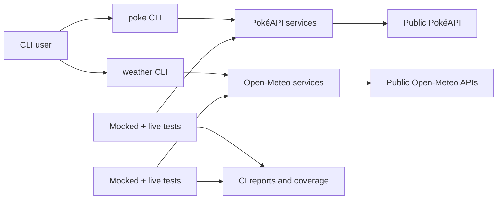

# API Test Realm

API Test Realm is a portfolio of small, practical API-testing examples. Each example pairs a useful command-line tool with a test suite that demonstrates how to build confidence in an API integration without creating brittle or misleading checks.

The focus is on choices that matter in real teams: fast deterministic feedback, deliberate live integration checks, consumer-centred contracts, useful failure evidence, and security-aware automation.

## Start here

Choose an example based on the kind of API risk you want to explore:

- [**PokéAPI example**](poke-api/README.md) — resource relationships, pagination, schemas, error paths, and a `poke` terminal explorer. [Quick start](poke-api/README.md#quick-start)
- [**Open-Meteo example**](open-meteo/README.md) — geocoding-to-forecast journeys, query parameters, units, timezones, and time-series integrity through a `weather` CLI. [Quick start](open-meteo/README.md#quick-start)

Each folder is self-contained: install dependencies and run commands from inside the chosen example.

## See the CLIs

The commands return focused, user-friendly JSON rather than pass through large upstream payloads. These previews show the kind of result each example is built to test.

### PokéAPI

### Open-Meteo

## What this repository demonstrates

- **Test strategy, not just test code:** mocked checks provide quick, repeatable pull-request feedback; live checks validate real public integrations without making their availability a merge condition.
- **Consumer-focused contracts:** tests protect the behaviour a CLI user relies on, rather than asserting every field in an upstream payload.
- **Practical API risks:** request construction, retries, errors, pagination, linked resources, units, timezones, historical data, response quality, and changing public data.
- **Actionable engineering feedback:** verbose Jest output, JSON test reports, coverage artifacts, linting, formatting, and GitHub CodeQL scanning.

## How it is structured

The two examples cover different API shapes on purpose. PokéAPI is useful for testing connected resources and pagination; Open-Meteo shows how parameters can change units, response shape, timezone interpretation, and time-series behaviour.

## Testing model

| Layer                       | Runs when             | Purpose                                                                                                        |
| --------------------------- | --------------------- | -------------------------------------------------------------------------------------------------------------- |
| Deterministic mocked tests  | Pull requests         | Validate repository-owned behaviour, including request construction, failure handling, and consumer contracts. |
| Live integration tests      | Manually              | Check real public API contracts and journeys when external availability and changing data are relevant.        |
| Quality and security checks | Locally and in GitHub | ESLint, Prettier, published test evidence, and CodeQL JavaScript/TypeScript scanning.                          |

This separation makes failures easier to interpret: a mocked-test failure is likely a change in this repository; a live-test failure may also involve the network, upstream data, or a public-service outage.

## Technology

| Area                      | Tools                                                      |
| ------------------------- | ---------------------------------------------------------- |
| Runtime                   | Node.js 24                                                 |
| Test runner               | Jest                                                       |
| Local API checks          | Supertest and Express (PokéAPI example)                    |
| Contract validation       | Ajv / JSON Schema (PokéAPI example)                        |
| Code quality              | ESLint and Prettier                                        |
| CI evidence               | GitHub Actions, Jest JSON reports, LCOV coverage artifacts |
| Security                  | GitHub CodeQL default setup                                |
| Optional terminal visuals | Chafa with repository-owned images and GIFs                |

## Docker

Both examples include a small Docker image for a repeatable, dependency-isolated deterministic test run:

- [PokéAPI Docker instructions](poke-api/README.md#docker)
- [Open-Meteo Docker instructions](open-meteo/README.md#docker)

The images use Node 24 and `npm ci`, run mocked tests only, and add no supporting services. They demonstrate a simple reproducible test environment—not a production deployment model.

## How to review this repo

1. Choose an example and follow its Quick start.
2. Run its mocked suite (`npm test`) and inspect `test/mocked/` to see the fast feedback layer.
3. Compare it with `test/live/`, then run `npm run test:live` when you want real-provider confidence.
4. Open the workflow run in GitHub Actions and download the Jest JSON report or coverage artifact to inspect CI evidence without rerunning locally.

The project is intentionally small enough to inspect in one sitting, but broad enough to support discussion about test design, API contracts, and delivery confidence.
